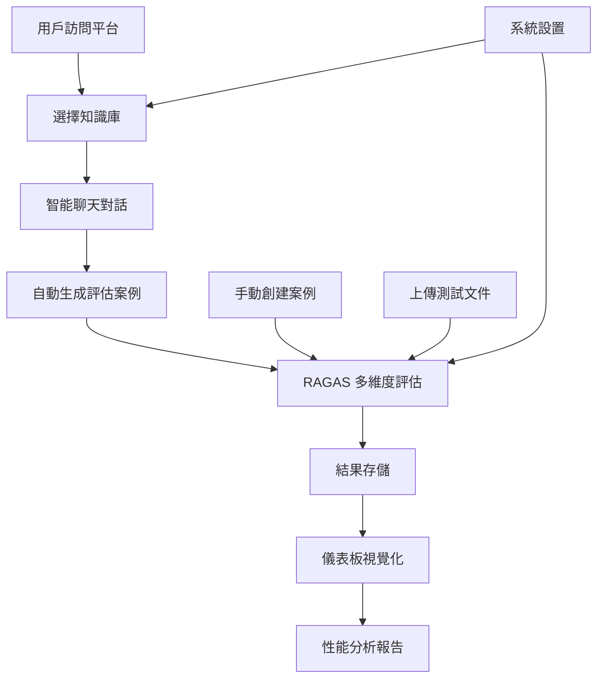

# 🤖 RAGFlow 整合智能平台使用指南

## 📋 項目概述

RAGFlow 整合智能平台是一個統一的 Streamlit 多頁面應用，將原本分散的聊天功能、RAGAS 評估和數據儀表板整合在一個平台中，提供完整的 RAG 系統開發和評估工作流程。

## 🏗️ 新架構特色

### ✅ **去除 FastAPI 中間層**
- 直接與 RAGFlow API 通信，減少系統複雜度
- 降低部署和維護成本
- 提升響應速度

### 🎯 **統一用戶界面**
- 單一入口點，四個功能標籤頁
- 一致的 UI 設計風格
- 頁面間數據無縫共享

### 📊 **完整工作流程**
```
聊天對話 → 自動準備評估案例 → RAGAS 評估 → 結果視覺化
```

## 🚀 快速開始

### 1. 環境準備
```bash
# 確保已安裝必要依賴
pip install streamlit plotly pandas numpy requests

# 可選：安裝 RAGAS 完整功能
pip install ragas datasets
```

### 2. 啟動應用
```bash
# 方法 1: 使用啟動腳本 (推薦)
python run_integrated_platform.py

# 方法 2: 直接啟動
streamlit run integrated_ragflow_platform.py --server.port 8501
```

### 3. 訪問應用
打開瀏覽器訪問: http://localhost:8501

## 📱 功能模組詳解

### 💬 **智能聊天模組**
**位置**: `pages/chat.py`

**核心功能**:
- RAGFlow API 直接整合
- 知識庫選擇和管理
- 實時聊天對話
- 聊天歷史管理
- 自動準備評估案例

**使用流程**:
1. 初始化 RAGFlow 客戶端
2. 選擇目標知識庫
3. 創建聊天會話
4. 開始智能對話
5. 查看參考來源
6. 導出聊天記錄

### 📏 **RAGAS 評估模組**
**位置**: `pages/evaluation.py`

**核心功能**:
- 多種數據來源支持 (聊天記錄/手動創建/文件上傳)
- 6種 RAGAS 評估指標
- 批量評估處理
- 結果保存和導出

**評估指標**:
- **Faithfulness** (忠實度): 檢測 AI 幻覺
- **Answer Relevancy** (答案相關性): 評估回答準確性
- **Context Precision** (上下文精確度): 檢索質量評估
- **Context Recall** (上下文召回率): 信息完整性檢測
- **Answer Similarity** (答案相似度): 語義相似性
- **Answer Correctness** (答案正確性): 綜合正確性評估

### 📊 **數據儀表板模組**
**位置**: `pages/dashboard.py`

**核心功能**:
- 評估結果載入和管理
- 多種圖表類型 (雷達圖/趨勢圖/對比圖/分布圖)
- 歷史數據分析
- 性能趨勢追蹤
- 數據導出和清理

**視覺化類型**:
- 🎯 **雷達圖**: 最新評估結果的多維度展示
- 📈 **趨勢圖**: 歷史評估指標變化趨勢
- ⚖️ **對比圖**: 不同時間點的評估結果比較
- 📊 **分布圖**: 所有評估分數的分布情況

### ⚙️ **系統設置模組**
**位置**: `pages/settings.py`

**核心功能**:
- RAGFlow API 連接配置
- OpenAI API 設置 (RAGAS 需要)
- 評估參數調整
- 系統狀態監控
- 配置導入/導出

## 🔧 配置說明

### API 設置
```python
# 環境變數配置
export RAGFLOW_API_URL="http://your-ragflow-server:8080"
export RAGFLOW_API_KEY="your-api-key"
export OPENAI_API_KEY="your-openai-key"  # 可選
```

### 評估參數
- **評估閾值**: 0.7 (建議值)
- **測試案例數**: 10 (默認)
- **默認指標**: Faithfulness + Answer Relevancy

## 🗂️ 文件結構

```
ragflow_api_fastapi/
├── integrated_ragflow_platform.py    # 主應用入口
├── run_integrated_platform.py        # 啟動腳本
├── pages/                            # 頁面模組
│   ├── chat.py                      # 聊天功能
│   ├── evaluation.py                # RAGAS 評估
│   ├── dashboard.py                 # 數據儀表板
│   └── settings.py                  # 系統設置
├── data/                            # 數據目錄
│   ├── evaluations/                 # 評估結果
│   ├── conversations/               # 聊天記錄
│   └── settings.json               # 系統配置
└── INTEGRATED_PLATFORM_GUIDE.md     # 使用指南
```

## 📊 數據流程圖



## 🎯 使用場景

### 1. **RAG 系統開發**
- 快速測試知識庫問答效果
- 實時調整和優化
- 獲取即時反饋

### 2. **系統性能評估**
- 標準化評估流程
- 多維度指標分析
- 歷史性能追蹤

### 3. **團隊協作**
- 統一評估標準
- 結果分享和討論
- 配置同步

## 🔍 故障排除

### 常見問題

**1. RAGFlow 連接失敗**
- 檢查 RAGFlow 服務是否運行
- 確認 API URL 和 Key 正確
- 測試網路連通性

**2. RAGAS 評估錯誤**
- 確認已安裝 ragas 和 datasets 包
- 檢查 OpenAI API Key 配置
- 驗證測試數據格式

**3. 儀表板圖表不顯示**
- 確認已安裝 plotly 包
- 檢查評估結果數據
- 確認數據格式正確

### 依賴檢查

```bash
# 檢查必要依賴
python -c "import streamlit, plotly, pandas, numpy, requests; print('✅ 核心依賴正常')"

# 檢查可選依賴
python -c "import ragas, datasets; print('✅ RAGAS 依賴正常')"
```

## 🚀 進階使用

### 自定義評估指標
```python
# 在 evaluation.py 中添加自定義指標
from ragas.metrics import AnswerRelevancyMetric

custom_metric = AnswerRelevancyMetric(threshold=0.8)
```

### 批量評估
- 準備大量測試案例
- 使用文件上傳功能
- 設置合適的評估參數

### 性能監控
- 定期檢查儀表板
- 追蹤關鍵指標趨勢
- 設置評估閾值告警

## 📈 最佳實踐

1. **定期評估**: 建議每週進行一次全面評估
2. **多指標並用**: 不要只依賴單一指標
3. **歷史對比**: 定期查看性能趨勢變化
4. **配置備份**: 定期導出系統配置
5. **數據清理**: 定期清理舊的評估數據

## 🎉 總結

RAGFlow 整合智能平台提供了一個完整的 RAG 系統開發和評估解決方案，通過統一的界面和流暢的工作流程，大大提升了開發效率和評估質量。

**主要優勢**:
- 🎯 **一站式解決方案**: 聊天、評估、分析全包含
- 🚀 **簡化架構**: 去除中間層，直接整合
- 📊 **專業評估**: 基於 RAGAS 學術標準
- 🎨 **用戶友善**: 直觀的操作界面
- 🔧 **易於擴展**: 模組化設計便於定制

立即開始使用，體驗高效的 RAG 系統開發流程！