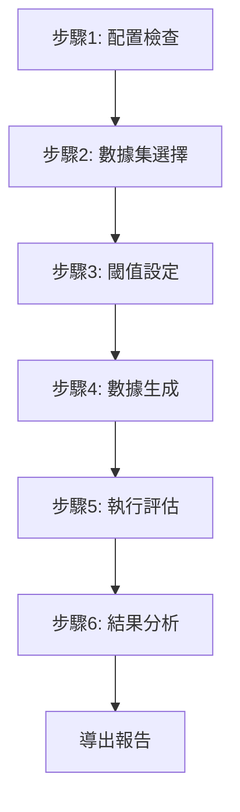

# DeepEval 完整評估系統使用指南

## 🎯 系統概述

DeepEval 完整評估系統是一個基於 Streamlit 的端到端評估應用，整合了從配置檢查到結果分析的完整 DeepEval 評估流程。

## 🚀 快速開始

### 一鍵啟動
```bash
python3 run_complete_app.py
```

### 手動啟動
```bash
streamlit run deepeval_complete_app.py --server.port 8502
```

## 📋 完整評估流程

### 🔄 六步驟評估流程



## 📊 詳細功能說明

### 步驟1: 🔍 系統配置檢查

**功能**：
- 檢查必要依賴包是否安裝
- 驗證 RAGFlow API 配置
- 測試 RAGFlow 服務連接
- 檢查 OpenAI API 配置（可選）

**界面元素**：
- ✅ 依賴包狀態指示器
- 📋 配置信息顯示面板
- 🔗 RAGFlow 連接測試結果
- ➡️ "繼續到下一步" 按鈕

**檢查項目**：
```
依賴包檢查:
✅ requests
✅ deepeval  
✅ openai
✅ pandas
✅ plotly

配置檢查:
✅ RAGFlow API URL 已配置
✅ RAGFlow API Key 已配置

RAGFlow 連接檢查:
✅ RAGFlow 連接成功，找到 3 個數據集
```

### 步驟2: 📚 數據集選擇

**功能**：
- 顯示所有可用的 RAGFlow 數據集
- 提供數據集詳細信息
- 智能識別數據集類型（法律/技術/通用）
- 提供選擇建議

**界面元素**：
- 📋 數據集選擇下拉框
- 📊 數據集詳情面板
- 💡 選擇建議側欄
- 🔄 導航按鈕

**數據集信息**：
```
📚 可用數據集:
1. 法律考試數據集 (150 文檔)
2. 技術文檔數據集 (89 文檔)  
3. 通用知識數據集 (234 文檔)

📋 數據集詳情:
名稱: 法律考試數據集
ID: dataset_legal_001
文檔數量: 150
創建時間: 2025-08-01
描述: 包含憲法、民法、刑法等法律考試內容
```

### 步驟3: 🎯 評估閾值設定

**功能**：
- 提供多種預設配置選項
- 支援個別指標閾值調整
- 實時顯示當前閾值狀態
- 提供專業領域建議

**預設配置**：
```python
預設配置選項:
- 開發階段: 寬鬆標準，適合快速迭代
- 生產環境: 嚴格標準，適合正式部署
- 法律專業: 最嚴格標準，適合法律應用
- 寬鬆標準: 最寬鬆標準，適合實驗測試
```

**界面元素**：
- 🎛️ 預設配置選擇器
- 📊 個別指標滑桿
- 📋 當前閾值狀態面板
- 💡 專業建議側欄

**閾值調整**：
```
正向指標 (分數越高越好):
Answer Relevancy: ████████░░ 0.80
Faithfulness: ██████████ 0.90
Contextual Precision: ████████░░ 0.80
Contextual Recall: ███████░░░ 0.70

負向指標 (分數越低越好):
Hallucination: ██░░░░░░░░ 0.10
Bias: ████░░░░░░ 0.20
```

### 步驟4: 📝 測試數據生成

**功能**：
- 三種數據生成方式
- 智能問題生成
- 文件載入支援
- 手動創建界面

**生成方式**：

#### 1. 自動生成 (推薦)
```
📝 數據生成選項:
• 測試問題數量: [滑桿 1-50]
• 生成策略: 🏛️ 法律專業問題
• [生成測試數據] 按鈕

生成過程:
🔄 正在生成測試數據...
✅ 成功生成 20 個測試案例
```

#### 2. 載入現有文件
```
📁 上傳 JSON 格式的測試數據文件
[拖拽上傳區域]

支援格式:
{
  "id": "test_001",
  "question": "什麼是憲法第7條？",
  "expected_answer": "憲法第7條規定平等原則...",
  "context": "憲法相關內容",
  "source": "manual"
}
```

#### 3. 手動創建
```
📝 手動創建測試案例:
問題: [文本框]
期望答案: [文本框]
[添加測試案例] 按鈕

已創建的測試案例:
▼ 案例 1: manual_1
  問題: 什麼是憲法的基本原則？
  期望答案: 憲法的基本原則包括...
  [刪除案例 1] 按鈕
```

### 步驟5: 🧪 執行評估

**功能**：
- 顯示評估參數摘要
- 實時評估進度顯示
- 評估狀態監控
- 結果即時統計

**評估界面**：
```
🧪 評估執行:

評估參數:
- 測試案例數量: 20
- 數據集: 法律考試數據集
- 評估閾值: answer_relevancy: 0.8, faithfulness: 0.9...

[🚀 開始評估] 按鈕

評估進度:
████████████████████ 100%
評估案例 20/20: 什麼是行政法的比例原則？

📊 評估狀態:
總案例數: 20
通過案例: 16 (80.0%)
平均分數: 0.756
```

**評估過程**：
```
🔄 評估案例 1/20: 什麼是憲法第7條的平等原則？
🔍 搜索中...
✅ 回答獲取成功
📊 計算評估指標...
✅ 案例 1 完成，分數: 0.856

🔄 評估案例 2/20: 民法中的契約自由原則是什麼？
...
```

### 步驟6: 📊 結果分析

**功能**：
- 四個分析標籤頁
- 豐富的視覺化圖表
- 詳細的案例分析
- 多種導出格式

#### 標籤頁1: 📈 整體摘要
```
📈 評估結果摘要:

關鍵指標:
┌─────────────┬─────────────┬─────────────┬─────────────┐
│  總測試案例  │   通過案例   │    通過率    │   平均分數   │
│     20      │     16      │    80.0%    │   0.756    │
└─────────────┴─────────────┴─────────────┴─────────────┘

📊 指標統計:
[雷達圖顯示各項指標的平均表現]
```

#### 標籤頁2: 📊 詳細分析
```
📊 詳細數據分析:

[整體分數分布直方圖]
[通過/失敗比例餅圖]
[指標相關性熱力圖]
```

#### 標籤頁3: 📋 案例詳情
```
📋 詳細案例分析:

篩選選項:
☐ 只顯示通過案例
☐ 只顯示失敗案例
最低分數: ████░░░░░░ 0.6

顯示 20 / 20 個結果:

▼ ✅ test_001 - 分數: 0.856
  問題: 什麼是憲法第7條的平等原則？
  實際回答: 憲法第7條規定中華民國人民...
  期望回答: 憲法第7條規定中華民國人民，無分男女...
  
  指標分數:
  ✅ answer_relevancy: 0.823
  ✅ faithfulness: 0.789
  ✅ contextual_precision: 0.734
  ...
```

#### 標籤頁4: 💾 導出結果
```
💾 導出評估結果:

CSV 格式:
[導出 CSV] 按鈕
→ [下載 CSV 文件] 按鈕

JSON 格式:
[導出 JSON] 按鈕  
→ [下載 JSON 文件] 按鈕

摘要報告:
[生成報告] 按鈕
→ [下載摘要報告] 按鈕
```

## 🎨 界面特色

### 🎯 進度指示器
```
步驟進度:
✅ 1. 配置檢查
✅ 2. 數據集選擇  
✅ 3. 閾值設定
🔄 4. 數據生成    ← 當前步驟
⏳ 5. 執行評估
⏳ 6. 結果分析
```

### 🎨 視覺化元素
- **成功框**: 綠色背景，顯示成功信息
- **警告框**: 黃色背景，顯示警告信息  
- **錯誤框**: 紅色背景，顯示錯誤信息
- **信息框**: 藍色背景，顯示一般信息
- **指標卡片**: 灰色背景，顯示關鍵數據

### 📱 響應式設計
- **桌面端**: 完整的雙欄布局
- **平板端**: 自適應單欄布局
- **手機端**: 垂直堆疊布局

## 🔧 高級功能

### 🎛️ 側邊欄功能
```
🧪 DeepEval 評估系統

📍 當前進度:
✅ 1. 配置檢查
✅ 2. 數據集選擇
🔄 3. 閾值設定
⏳ 4. 數據生成
⏳ 5. 執行評估
⏳ 6. 結果分析

🚀 快速導航:
[重新開始] 按鈕

💡 使用提示:
設定評估指標的閾值標準
```

### 🔄 會話狀態管理
- **自動保存**: 每步驟的設定自動保存
- **狀態恢復**: 刷新頁面後狀態保持
- **錯誤恢復**: 出錯後可回到上一步
- **重新開始**: 一鍵清除所有狀態

### 📊 實時數據更新
- **進度條**: 實時顯示評估進度
- **狀態指示**: 動態更新評估狀態
- **結果統計**: 即時計算統計數據
- **圖表更新**: 自動刷新視覺化圖表

## 💡 使用技巧

### 🎯 最佳實踐
1. **首次使用**: 建議使用"開發階段"閾值設定
2. **數據生成**: 推薦使用自動生成，數量設為10-20個
3. **結果分析**: 重點關注失敗案例，找出改進方向
4. **報告導出**: 定期導出結果用於版本對比

### 🔍 故障排除
1. **配置檢查失敗**: 檢查 config.py 文件和 API 設定
2. **數據集載入失敗**: 確認 RAGFlow 服務正常運行
3. **評估執行失敗**: 檢查 OpenAI API 配置和網絡連接
4. **結果顯示異常**: 清除瀏覽器緩存並重新載入

### ⚡ 性能優化
1. **大數據集**: 建議分批評估，每批10-20個案例
2. **網絡問題**: 設置較長的超時時間
3. **內存使用**: 定期清理會話狀態
4. **並發限制**: 避免同時運行多個評估

## 🚀 實際使用場景

### 場景1: 系統開發階段
```bash
# 1. 啟動應用
python3 run_complete_app.py

# 2. 選擇開發數據集
# 3. 使用"開發階段"閾值
# 4. 生成10個測試案例
# 5. 執行評估
# 6. 分析結果，找出問題
```

### 場景2: 生產環境驗證
```bash
# 1. 選擇生產數據集
# 2. 使用"生產環境"閾值
# 3. 生成30個測試案例
# 4. 執行完整評估
# 5. 導出詳細報告
# 6. 基於結果決定是否部署
```

### 場景3: 法律專業評估
```bash
# 1. 選擇法律數據集
# 2. 使用"法律專業"閾值
# 3. 生成法律專業問題
# 4. 執行嚴格評估
# 5. 重點檢查faithfulness和hallucination
# 6. 生成合規報告
```

## 📚 相關資源

- [DeepEval 官方文檔](https://docs.confident-ai.com/)
- [Streamlit 文檔](https://docs.streamlit.io/)
- [評估指標說明](metrics_explanation.md)
- [閾值設定指南](why_thresholds_matter.md)
- [RAGFlow API 文檔](https://ragflow.io/docs/dev/python_api_reference)

## 🎉 總結

DeepEval 完整評估系統提供了：

✅ **端到端流程** - 從配置到報告的完整評估流程
✅ **直觀界面** - 步驟式引導，易於使用
✅ **專業功能** - 豐富的評估指標和分析工具
✅ **靈活配置** - 支援多種閾值和數據生成方式
✅ **詳細分析** - 多維度的結果分析和視覺化
✅ **報告導出** - 多種格式的專業報告生成

這是一個生產就緒的評估系統，適合各種規模的 RAG 系統評估需求！

---

**更新時間**: 2025年8月3日  
**版本**: v1.0.0  
**維護者**: Kiro AI Assistant