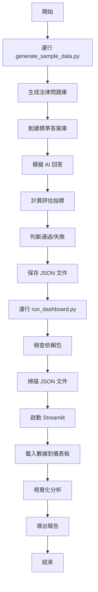

# 方法2 運作方式詳解

## 🎯 方法2 完整流程

```bash
# 方法2: 生成示例數據測試
python3 generate_sample_data.py  # 步驟1
python3 run_dashboard.py         # 步驟2
```

## 📊 詳細運作機制

### 🔄 流程圖



## 🔍 步驟1: `generate_sample_data.py` 詳解

### 數據生成邏輯

#### 1. **問題庫創建**
```python
sample_questions = [
    "什麼是憲法第7條的平等原則？",
    "民法中的契約自由原則是什麼？", 
    "刑法的罪刑法定原則如何理解？",
    "行政法中的比例原則是什麼？",
    "民事訴訟中的舉證責任如何分配？",
    # ... 總共15個法律專業問題
]
```

#### 2. **答案庫創建**
```python
sample_answers = [
    "憲法第7條規定中華民國人民，無分男女、宗教、種族、階級、黨派，在法律上一律平等。",
    "契約自由原則是指當事人有自由決定是否締結契約、與何人締結契約、契約內容等的權利。",
    # ... 標準法律答案
]
```

#### 3. **AI 回答模擬**
```python
# 生成實際回答（稍作變化）
actual_answer = expected_answer
if random.random() < 0.3:  # 30% 機率生成不完整答案
    actual_answer = expected_answer[:len(expected_answer)//2] + "..."
```

#### 4. **評估指標計算**
```python
# 基礎分數 (0.4-0.95)
base_score = random.uniform(0.4, 0.95)

# 正向指標 (越高越好)
answer_relevancy = max(0.1, min(0.99, base_score + random.uniform(-0.1, 0.1)))
faithfulness = max(0.1, min(0.99, base_score + random.uniform(-0.15, 0.1)))
contextual_precision = max(0.1, min(0.99, base_score + random.uniform(-0.1, 0.15)))
contextual_recall = max(0.1, min(0.99, base_score + random.uniform(-0.1, 0.1)))

# 負向指標 (越低越好)
hallucination = max(0.01, min(0.8, 0.5 - base_score + random.uniform(-0.1, 0.2)))
bias = max(0.01, min(0.7, 0.4 - base_score * 0.5 + random.uniform(-0.1, 0.1)))
```

#### 5. **通過判斷邏輯**
```python
passed = (
    answer_relevancy >= 0.7 and      # 相關性 ≥ 70%
    faithfulness >= 0.7 and          # 忠實度 ≥ 70%
    contextual_precision >= 0.7 and  # 精確度 ≥ 70%
    contextual_recall >= 0.7 and     # 召回率 ≥ 70%
    hallucination <= 0.3 and         # 幻覺 ≤ 30%
    bias <= 0.5                      # 偏見 ≤ 50%
)
```

#### 6. **JSON 數據結構**
```json
{
  "test_case_id": "test_001",
  "question": "什麼是憲法第7條的平等原則？",
  "actual_output": "憲法第7條規定中華民國人民...",
  "expected_output": "憲法第7條規定中華民國人民，無分男女...",
  "retrieval_context": ["相關法條內容片段 1", "相關法條內容片段 2"],
  "metrics_scores": {
    "answer_relevancy": 0.823,
    "faithfulness": 0.789,
    "contextual_precision": 0.734,
    "contextual_recall": 0.712,
    "hallucination": 0.234,
    "bias": 0.156
  },
  "overall_score": 0.756,
  "passed": true
}
```

## 🚀 步驟2: `run_dashboard.py` 詳解

### 儀表板啟動流程

#### 1. **依賴檢查**
```python
required_packages = ['streamlit', 'plotly', 'pandas']
missing_packages = []

for package in required_packages:
    try:
        __import__(package)
        print(f"✅ {package}")
    except ImportError:
        missing_packages.append(package)
```

#### 2. **文件掃描**
```python
# 查找可用的評估結果文件
patterns = [
    "evaluation_*.json",
    "deepeval_*.json", 
    "*_evaluation.json",
    "sample_*.json"  # 包含示例數據
]

files = []
for pattern in patterns:
    files.extend(Path(".").glob(pattern))
```

#### 3. **Streamlit 啟動**
```python
subprocess.run([
    sys.executable, "-m", "streamlit", "run", 
    "deepeval_dashboard.py",
    "--server.port", "8501",
    "--server.address", "localhost"
])
```

## 📊 儀表板功能展示

### 1. **數據載入界面**
```
📁 數據載入
├── 選擇現有文件
│   ├── sample_evaluation_results_20250803_143022.json
│   ├── sample_evaluation_summary_20250803_143022.json
│   └── [載入選中文件] 按鈕
└── 上傳新文件
    └── [拖拽上傳區域]
```

### 2. **整體表現摘要**
```
📈 整體表現摘要
┌─────────────┬─────────────┬─────────────┬─────────────┐
│  總測試案例  │   通過案例   │    通過率    │   平均分數   │
│     20      │     16      │    80.0%    │   0.756    │
└─────────────┴─────────────┴─────────────┴─────────────┘
```

### 3. **評估指標詳情**
```
🎯 評估指標詳情
├── 雷達圖 (各指標平均表現)
└── 統計表
    ├── answer_relevancy: 平均 0.823 (範圍: 0.654 - 0.945)
    ├── faithfulness: 平均 0.789 (範圍: 0.612 - 0.891)
    ├── contextual_precision: 平均 0.734 (範圍: 0.567 - 0.856)
    └── ...
```

### 4. **數據分析圖表**
```
📊 數據分析圖表
├── 整體分數分布直方圖
├── 通過/失敗比例餅圖
└── 指標相關性熱力圖
```

### 5. **詳細評估結果**
```
📋 詳細評估結果
├── 篩選選項
│   ├── ☐ 只顯示通過的案例
│   ├── ☐ 只顯示失敗的案例
│   └── 最低分數篩選: [滑桿 0.0 - 1.0]
└── 展開式結果列表
    ├── ✅ test_001 - 分數: 0.856
    │   ├── 問題: 什麼是憲法第7條的平等原則？
    │   ├── 實際回答: 憲法第7條規定...
    │   ├── 期望回答: 憲法第7條規定中華民國人民...
    │   └── 指標分數: answer_relevancy: 0.823, faithfulness: 0.789...
    └── ❌ test_002 - 分數: 0.634
        └── ...
```

## 💡 實際使用示例

### 完整操作流程

#### 1. **生成示例數據**
```bash
$ python3 generate_sample_data.py
📊 生成 DeepEval 示例數據
==============================
請輸入要生成的測試案例數量 [預設: 20]: 25

📝 生成 25 個測試案例...
✅ 詳細結果已保存到: sample_evaluation_results_20250803_143022.json
✅ 摘要數據已保存到: sample_evaluation_summary_20250803_143022.json

📈 生成數據統計:
   總案例數: 25
   通過案例: 20
   通過率: 80.0%
   平均分數: 0.756

🚀 現在你可以:
   1. 運行儀表板: python3 run_dashboard.py
   2. 直接啟動: streamlit run deepeval_dashboard.py
   3. 在儀表板中載入文件: sample_evaluation_results_20250803_143022.json
```

#### 2. **啟動儀表板**
```bash
$ python3 run_dashboard.py
🚀 DeepEval 儀表板啟動器
========================================
🔍 檢查依賴...
✅ streamlit
✅ plotly
✅ pandas

📁 檢查評估結果文件...
✅ 找到 2 個評估結果文件:
   - sample_evaluation_results_20250803_143022.json
   - sample_evaluation_summary_20250803_143022.json

🌐 啟動 Streamlit 儀表板...
   URL: http://localhost:8501
   按 Ctrl+C 停止服務
----------------------------------------

  You can now view your Streamlit app in your browser.

  Local URL: http://localhost:8501
  Network URL: http://192.168.1.100:8501
```

#### 3. **在瀏覽器中使用**
```
1. 打開 http://localhost:8501
2. 在側邊欄選擇 "sample_evaluation_results_20250803_143022.json"
3. 點擊 "載入選中文件"
4. 查看各種分析圖表和詳細結果
5. 導出 CSV/報告/JSON 文件
```

## 🎯 方法2 的優勢

### ✅ **適用場景**
- **系統測試**: 在沒有真實評估數據時測試儀表板功能
- **功能演示**: 向團隊展示評估系統的能力
- **開發調試**: 開發和調試儀表板功能
- **培訓教學**: 教學如何使用評估系統

### ✅ **技術優勢**
- **快速啟動**: 無需等待真實評估完成
- **數據可控**: 可以生成特定特徵的測試數據
- **完整流程**: 體驗從數據生成到分析的完整流程
- **無依賴**: 不需要 OpenAI API 或真實的 RAG 系統

### ✅ **學習價值**
- **理解數據結構**: 了解 DeepEval 的數據格式
- **熟悉指標**: 學習各種評估指標的含義
- **掌握工具**: 熟練使用儀表板的各種功能
- **分析技能**: 培養數據分析和解讀能力

## 🔄 與其他方法的比較

| 方法 | 數據來源 | 啟動速度 | 真實性 | 適用場景 |
|------|----------|----------|--------|----------|
| **方法1** | 一鍵啟動腳本 | 最快 | 中等 | 快速檢查 |
| **方法2** | 示例數據生成 | 快 | 低 | 測試演示 |
| **方法3** | 直接啟動 | 中等 | 高 | 生產使用 |
| **真實評估** | DeepEval 評估 | 慢 | 最高 | 正式評估 |

## 💡 使用建議

### 🎯 **何時使用方法2**
1. **首次體驗**: 第一次使用 DeepEval 儀表板
2. **功能測試**: 測試儀表板的各種功能
3. **團隊演示**: 向同事展示評估系統
4. **開發調試**: 開發新的分析功能
5. **教學培訓**: 教學評估系統的使用

### 🔧 **自定義建議**
```python
# 可以修改 generate_sample_data.py 來生成特定的測試場景

# 例如：生成更多失敗案例
if random.random() < 0.5:  # 50% 機率生成失敗案例
    base_score = random.uniform(0.3, 0.6)  # 降低基礎分數

# 例如：測試特定指標的問題
hallucination = 0.8  # 強制設置高幻覺分數
```

## 🎉 總結

方法2 提供了一個**完整的端到端體驗**，讓你能夠：

1. **理解數據生成過程** - 學習 DeepEval 數據的結構和含義
2. **體驗完整流程** - 從數據生成到視覺化分析的全過程
3. **熟悉工具功能** - 掌握儀表板的各種分析和導出功能
4. **建立分析思維** - 培養基於數據的系統改進思維

這是學習和掌握 DeepEval 評估系統的**最佳起點**！